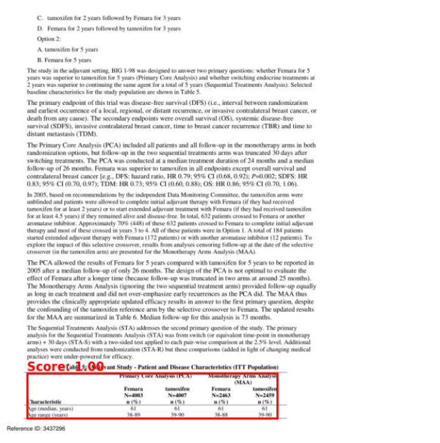
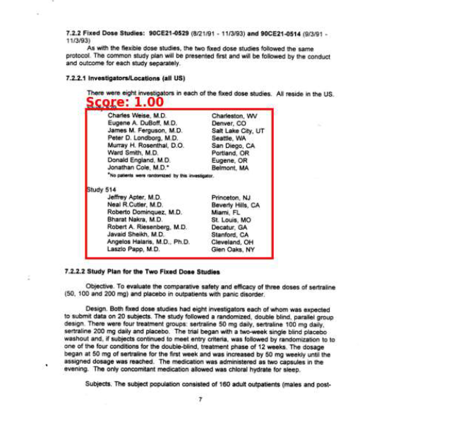
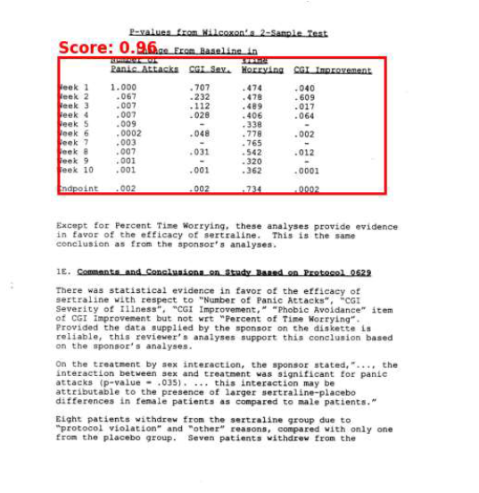
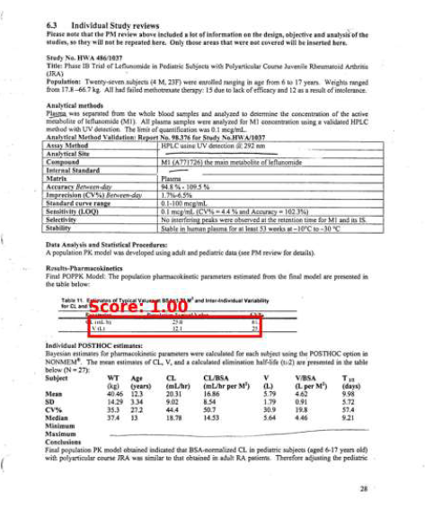

## Overview

The main objective of this project is to:
- Load images from the folder.
- Use Microsoft's Table Transformer model to detect tables in the images.
- Visualize the bounding boxes around the detected tables.

## Example Output

Here are a few examples of table detection results:

