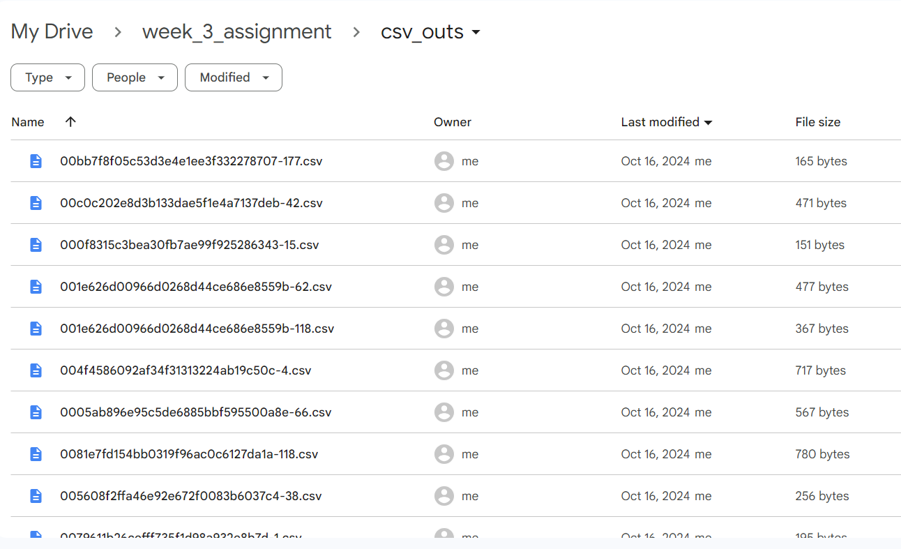

## Overview

This project implements a pipeline using Microsoft's **Table Transformer (TATR)** models to process document page images. The pipeline is capable of detecting table regions within images and exporting their structure into CSV format, preserving rows and columns. The pipeline performs:

1. **Table Detection**: Identifies table boundaries within the document images.
2. **Table Structure Decomposition**: Breaks down the detected tables into rows and columns.
3. **Table to CSV Conversion**: Extracted table structure is saved as a CSV file.


## Pipeline Steps

### 1. Table Detection
Using the **Table Transformer Detection Model** from Hugging Face, the pipeline scans each document page image and detects table boundaries. For improved accuracy, image preprocessing techniques such as contrast enhancement and resizing are applied.

```python
# Load Table Transformer Detection Model
detection_model = TableTransformerForObjectDetection.from_pretrained('microsoft/table-transformer-detection')
processor = DetrImageProcessor.from_pretrained('microsoft/table-transformer-detection')

# Detect tables in an image
image, boxes, scores, labels = detect_table(image_path, confidence_threshold=0.3)
```

Here are a few examples of table detection results:


### 2. Table Structure to csv Format

```python
# Function to save table detection results to CSV file
def save_table_to_csv(results_structure, image_name, output_dir=csv_out_dir):
    table_data = []

    for i, result in enumerate(results_structure):
        elements = result['boxes']
        # Convert table boxes into a list of coordinates
        table_data.append([box.int().tolist() for box in elements])

    # Convert the table data to a pandas DataFrame
    df = pd.DataFrame(table_data)  # Customize this based on your table structure

    # Create the corresponding CSV file name based on the image name
    base_name = os.path.splitext(image_name)[0]
    output_csv_path = os.path.join(output_dir, f"{base_name}.csv")

    # Save the DataFrame to a CSV file
    df.to_csv(output_csv_path, index=False, header=False)

    print(f"CSV saved: {output_csv_path}")
```

Examples of CSV results:




